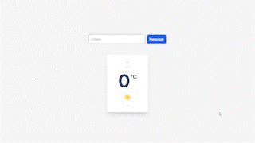
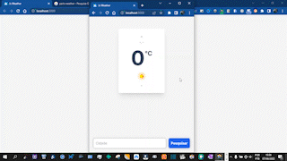

# JsWeather
Aplicação de clima com React - em inglês. Veja o clima da cidade que você quiser. 

## Preview

### Desktop


### Mobile
<div style="height: 200px; width: 200px;"></div>

## Acessar Projeto
Para clonar o projeto, você pode utilizar o ```git clone``` no terminal **git bash** ou um de sua preferência.

Ex: ```git clone https://github.com/maxsuel-santos/js-weather```.

Além disso, você pode baixar o arquivo zip direto do GitHub. Fique a seu critério.

Depois de ter em mãos o projeto, você pode usar o ```npm start``` para iniciar o sevidor local na sua máquina. Com isso, será aberta o sevidor local na url **http://localhost:3000/**.

## Linguagens e Ferramentas Utilizadas


